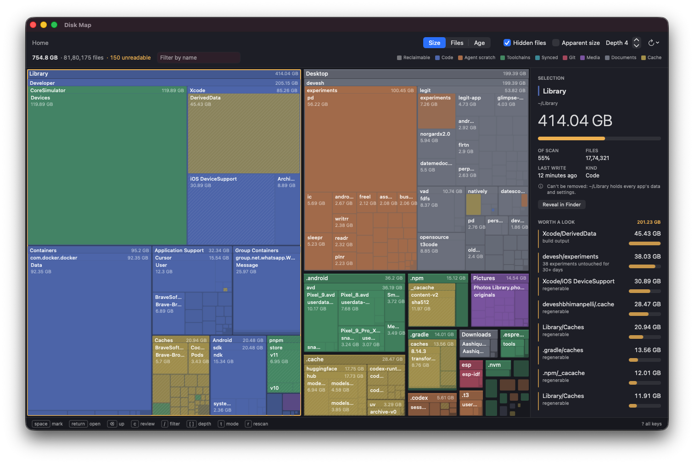
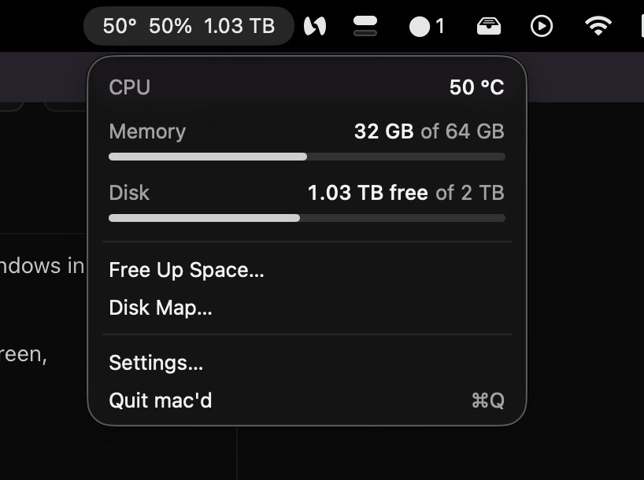

# mac'd

A minimal macOS menu bar app: CPU temperature, memory, and disk space at a glance, a
one-click cleanup, and a treemap for seeing exactly what's filling your disk.

No terminal, no Homebrew. Cleaning is powered by a bundled copy of
[Mole](https://github.com/tw93/Mole); the disk map is a native port of
[disktree](https://github.com/tobi/disktree)'s scanner, treemap layout, and classification.



<p align="center">
  
</p>

**Everything stays on your Mac.** mac'd makes no network requests: no accounts, analytics,
crash reporting, or update checks. Scans, the saved disk map, and cleanup all happen locally.

## Features

- **Menu bar readout** — CPU temperature, memory used, and disk free, updated live and
  configurable per-metric.
- **Free Up Space** — previews what Mole would clean, grouped into plain-language
  categories with sizes, before anything is deleted. Lists what it skipped and why (open apps,
  admin-only caches).
- **Disk Map** — a treemap of your home folder. Colour shows the kind of data (code, agent
  scratch, toolchains, synced files, git, media, documents, cache); a hatch marks space you
  can get back. Mark items, review them, and move them to the Trash or delete permanently,
  each behind rules that refuse to touch anything outside the scan, the home folder itself,
  or macOS's own files.
- **Instant reopen** — the disk map saves its scan and, next time, shows it immediately and
  re-reads only the folders macOS's change journal (FSEvents) says have changed. While the
  window is open it keeps up with changes in the background.
- **Worth a Look** — the biggest reclaimable folders, stale agent worktrees, and abandoned
  experiments, surfaced automatically.
- **Low-space alert** — a notification when free space drops below a threshold you set.

Requires macOS 15 or later. CPU temperature reads Apple Silicon's sensors directly.

## Privacy

- mac'd never connects to the internet. The only links in the app (Mole's source and license,
  in Settings) open in your browser only when you click them.
- The bundled Mole is only ever run as `mole clean` and `mole clean --dry-run`, which work on
  local files. Mole's own update check runs only from its interactive menu, which mac'd never
  opens.
- The disk map's saved scan (file names and sizes) lives in
  `~/Library/Caches/com.devesh.macd/` and never leaves it. Delete that folder any time; the next
  open just scans again.

## Install

There's no signed release yet — build it from source:

```bash
brew install xcodegen
git clone https://github.com/Deveshb15/macd.git
cd macd
scripts/fetch-mole.sh     # vendors the pinned Mole release into Vendor/mole
xcodegen generate         # creates Macd.xcodeproj from project.yml
open Macd.xcodeproj
```

Build and run the `Macd` scheme. The app requests access to Desktop, Documents, and
Downloads on first scan, and shows how to grant Full Disk Access for folders like Mail that
need it.

## Develop

```bash
xcodebuild test -project Macd.xcodeproj -scheme Macd
```

The test suite covers the scanner, the treemap layout, classification, every removal safety
rule, and the cleanup preview parser — run it after any change to `Macd/DiskMap` or
`Macd/Mole`.

## Release

```bash
DEVELOPMENT_TEAM=ABCDE12345 NOTARY_PROFILE=macd-notary scripts/notarize.sh
```

Produces a signed, notarized, and stapled `build/macd.dmg`.

## Updating Mole

1. Change `MOLE_VERSION`, `MOLE_COMMIT`, and `SOURCE_TREE_SHA256` in `scripts/fetch-mole.sh`.
2. Run `scripts/fetch-mole.sh`.
3. Capture a fresh `mole clean --dry-run` and `mole analyze -json` output into
   `MacdTests/Fixtures/`, then run the tests. The cleanup preview parses Mole's text
   output, so a Mole update can break it — the fixtures catch that.

## Third-party software

mac'd's own code is MIT-licensed — see [LICENSE](LICENSE).

- **[Mole](https://github.com/tw93/Mole)** (GPL-3.0-or-later) is bundled and runs as a
  separate program mac'd launches; its code is not linked into the app.
- **[disktree](https://github.com/tobi/disktree)** (MIT) is the model for the disk map —
  its scanning approach, treemap layout, classification rules, and removal safety rules are
  ported to Swift.

Full notices and license text: `Macd/Resources/THIRD_PARTY_NOTICES.md`.
