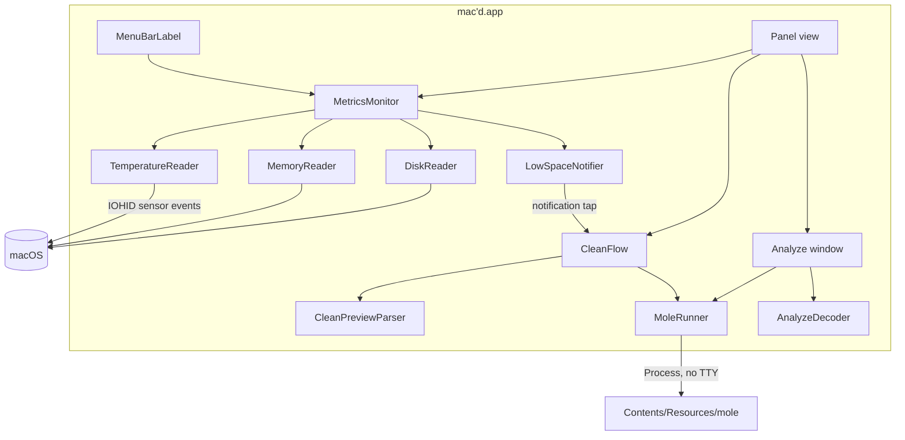
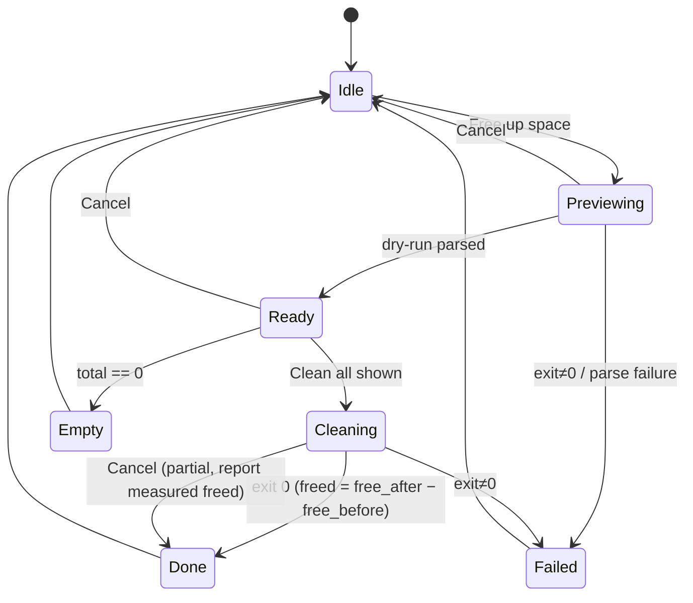

# feat: mac'd menu bar health monitor with bundled Mole cleanup

## Summary

Build a native Swift/SwiftUI menu bar app that reads CPU temperature, RAM, and free disk space directly from macOS, and drives a bundled, pinned copy of Mole for the cleanup preview, the clean, and disk analysis. The app ships as a Developer ID–signed, notarized download.

---

## Problem Frame

Mole does the cleaning well, but only from a terminal. The app's job is to put a trustworthy GUI in front of it and to notice when cleaning is needed (see origin: `docs/brainstorms/2026-09-24-macd-menu-bar-requirements.md`). The repo is empty, so this is greenfield. The technical risk sits at the Mole seam: `mo clean` has no machine-readable output, cannot clean a subset of categories, and the Homebrew copy hardcodes its own install path.

---

## Requirements

Carried from origin. IDs match the origin doc.

**Menu bar glance**
- R1. The menu bar item shows CPU temperature, RAM use, and free disk space compactly.
- R2. The user chooses which metrics appear in the menu bar.
- R3. Refresh cadence keeps the app's own CPU and energy use negligible.
- R4. CPU temperature works on Apple Silicon without Mole.
- R5. An unreadable metric shows as unavailable, never as a wrong number.

**Panel**
- R6. The panel shows the three metrics in more detail.
- R7. The panel offers Free up space and Analyze disk.

**Cleanup**
- R8. Free up space runs a preview listing plain-language categories, their sizes, and a total.
- R9. The preview offers only Clean all shown or Cancel.
- R10. Nothing is deleted before confirmation.
- R11. The result reports space freed and anything skipped, including admin-only items.
- R12. Preview and clean show progress and handle cancellation and failure clearly.

**Disk analysis**
- R13. The Analyze window lists space usage largest first, with folder drill-down.
- R14. Any item can be revealed in Finder.

**Nudges**
- R15. A notification fires when free space drops below a threshold and opens the cleanup preview.
- R16. The threshold is configurable and can be turned off.

**Packaging**
- R17. Mole ships inside the app, with no Homebrew or terminal needed.
- R18. Launch at login is an option.

**Origin acceptance examples:** AE1 (preview before delete), AE2 (clean all → freed amount), AE3 (admin items reported as skipped), AE4 (notify once below threshold), AE5 (`—°` when temperature is unreadable).

---

## Key Technical Decisions

- **Swift 6 + SwiftUI `MenuBarExtra` (window style), macOS 14 minimum:** native, lightest footprint, and uses the Observation framework. macOS 14 covers every Apple Silicon Mac that is still updated.
- **Generate the Xcode project with XcodeGen (`project.yml`):** the project file stays reviewable and diff-friendly. `xcodegen` is already installed locally.
- **Live metrics come from macOS APIs, not `mo status`:** starting a process every few seconds would break R3. RAM uses Mach host VM statistics. Free disk uses the volume's "available for important usage" capacity, which matches Finder because it counts purgeable space.
- **CPU temperature reads the IOHID sensor event system, the private interface Stats uses:** Mole returns `0` on an M2 Max. The call sits behind a protocol and returns `nil` on any failure, so the UI shows `—°` (R5, AE5).
- **Refresh every 5 s while the menu bar is visible, and every 1 s while the panel is open:** fast enough to feel live, and cheap because nothing is spawned (R3).
- **Bundle Mole from a pinned upstream release, not from the Homebrew copy:** the Homebrew wrapper hardcodes `SCRIPT_DIR` to the Cellar path. The upstream release resolves its location dynamically, and it has no runtime dependencies and runs on the system bash 3.2.
- **Run Mole non-interactively in a controlled environment:** stdin is `/dev/null`, color output is disabled, and each run gets its own process group so Cancel can stop the whole tree. With no terminal and no sudo, Mole skips the system caches that need an admin password and prints a notice, which becomes the "skipped" entry (AE3).
- **Parse the dry-run text against the pinned Mole version, and test with saved real output:** Mole has no JSON mode for `clean`. The parser tolerates unknown lines and reports parse failure rather than showing a partial total. A JSON mode contributed upstream would replace the parser later.
- **Freed space is measured, not parsed:** the result compares disk free before and after the clean. That keeps working even if Mole's summary text changes (AE2).
- **Disk analysis uses Mole's `analyze` in JSON mode:** it is structured and already fast, so there is no need to write a native scanner.
- **GPL-3.0 compliance through aggregation:** Mole stays a separate executable launched as a process. The app ships Mole's license and a source link in its About and notices screens.

---

## High-Level Technical Design

Component shape. Arrows show data flow.



Clean flow state machine (R8–R12):



Only one clean flow can run at a time. A notification tap while a flow is running brings the panel forward and does not start a second flow.

---

## Output Structure

```text
project.yml
Macd/
  App/            MacdApp, AppSettings
  Metrics/        MetricsMonitor, MemoryReader, DiskReader, TemperatureReader, Formatters
  Mole/           MoleRunner, CleanPreviewParser, CleanFlow, AnalyzeDecoder
  Notifications/  LowSpaceNotifier
  UI/             MenuBarLabel, PanelView, CleanSheet, AnalyzeWindow, SettingsView, AboutView
  Resources/      Info.plist, Assets, THIRD_PARTY_NOTICES.md
MacdTests/
  Fixtures/       mole-clean-dry-run-1.49.2.txt, mole-analyze-1.49.2.json
Vendor/mole/      pinned upstream release + VERSION + LICENSE
scripts/          fetch-mole.sh, embed-mole.sh, notarize.sh
```

---

## Implementation Units

### U1. Project scaffold and menu bar shell

**Goal:** A launchable menu bar–only app with a test target and persisted settings.

**Requirements:** R2, R16, R18 (settings storage)

**Dependencies:** none

**Files:** `project.yml`, `Macd/App/MacdApp.swift`, `Macd/App/AppSettings.swift`, `Macd/Resources/Info.plist`, `MacdTests/AppSettingsTests.swift`

**Approach:** Use an agent (`LSUIElement`) app with a `MenuBarExtra` in window style and a hardened runtime with no sandbox. Store settings in `UserDefaults` behind an observable settings type: visible metrics (all three on by default), low-space threshold (default 20 GB, on), and launch at login. Implement launch at login with `SMAppService.mainApp`.

**Test scenarios:**
- A fresh install gets defaults of all metrics visible, threshold 20 GB enabled, and launch at login off.
- Changing a setting persists and reloads across a new settings instance.
- A threshold of 0 or a negative value is rejected or clamped to "off".

**Verification:** The app builds and shows a placeholder menu bar item with no Dock icon.

### U2. System metrics readers and monitor

**Goal:** Reliable, cheap readings for temperature, RAM, and disk.

**Requirements:** R1, R3, R4, R5; AE5

**Dependencies:** U1

**Files:** `Macd/Metrics/MetricsMonitor.swift`, `Macd/Metrics/MemoryReader.swift`, `Macd/Metrics/DiskReader.swift`, `Macd/Metrics/TemperatureReader.swift`, `Macd/Metrics/Formatters.swift`, `MacdTests/MetricsMonitorTests.swift`, `MacdTests/FormattersTests.swift`

**Approach:** Each reader sits behind a small protocol that returns an optional value, so tests inject stubs. The RAM reading follows Activity Monitor's "Memory Used" (app + wired + compressed). The temperature reading averages the CPU die sensors, and the reader discards readings of 0 or outside 1–150 °C as unavailable. The monitor publishes a snapshot and switches cadence when the panel is open.

**Patterns to follow:** Stats (exelban/stats) sensor module for the IOHID sensor-event approach and Apple Silicon sensor naming.

**Test scenarios:**
- Covers AE5. The temperature reader returns `nil` → the snapshot marks temperature unavailable → formatted as `—°`.
- A temperature reading of `0` or `200` is treated as unavailable.
- Formatting: 18_000_000_000 bytes free → `18 GB`, and 999 MB → `999 MB`. Temperature 42.6 → `43°`. RAM 61.4 % → `61%`.
- The monitor uses a 5 s interval normally and 1 s while the panel is open, and switches back when the panel closes.
- One reader failing does not blank the other two metrics.

**Verification:** On the author's M2 Max, all three values are non-zero and plausible next to Activity Monitor and Finder.

### U3. Menu bar label, panel, and settings UI

**Goal:** The glanceable readout and the panel with the two actions.

**Requirements:** R1, R2, R6, R7, R16, R18

**Dependencies:** U2

**Files:** `Macd/UI/MenuBarLabel.swift`, `Macd/UI/PanelView.swift`, `Macd/UI/SettingsView.swift`, `MacdTests/MenuBarLabelTests.swift`

**Approach:** The label renders only the enabled metrics in monospaced digits so the width doesn't jitter. If every metric is disabled, it falls back to an icon. The panel shows used/total RAM, free/total disk, and temperature, then the Free up space and Analyze disk buttons, then Settings and Quit. Keep the label-string composition in a pure function so it can be tested.

**Test scenarios:**
- Only disk enabled → the label shows the disk value alone.
- All metrics disabled → the icon-only fallback.
- Temperature unavailable with the other two enabled → `—°  61%  180 GB`.

**Verification:** Toggling metrics in Settings updates the menu bar immediately.

### U4. Bundled Mole and process runner

**Goal:** A pinned Mole inside the app bundle, plus a safe way to run it.

**Requirements:** R12, R17

**Dependencies:** U1

**Files:** `Vendor/mole/` (pinned release, `VERSION`, `LICENSE`), `scripts/fetch-mole.sh`, `scripts/embed-mole.sh`, `project.yml` (build phase), `Macd/Mole/MoleRunner.swift`, `Macd/Resources/THIRD_PARTY_NOTICES.md`, `MacdTests/MoleRunnerTests.swift`

**Approach:** `fetch-mole.sh` downloads a tagged upstream release, verifies its checksum, and vendors it. `embed-mole.sh` runs as a build phase: it copies Mole into `Contents/Resources/mole` and signs the Go binaries with the app's identity and hardened runtime. `MoleRunner` launches Mole as a subprocess with stdin set to `/dev/null`, color disabled, `HOME` set to the user's home, and its own process group. It streams stdout lines, supports cancellation (interrupt, then terminate after a grace period), and enforces a timeout.

**Execution note:** Before building anything on top, confirm that the vendored `mole` resolves its script directory from inside the bundle and that `clean --dry-run` behaves the same as the Homebrew copy.

**Test scenarios:**
- Running a stub script that prints three lines streams exactly those lines in order.
- A non-zero exit surfaces as a failure that includes the exit code and the last output lines.
- Cancelling mid-run stops the stub and its child processes within the grace period.
- A missing Mole binary gives a clear "cleaning engine missing" error, not a crash.

**Verification:** The built `.app` runs its bundled `mole --version` while Homebrew is off `PATH`.

### U5. Cleanup preview parser and clean flow

**Goal:** A preview a non-technical user can read, an all-or-nothing clean, and an honest result.

**Requirements:** R8, R9, R10, R11, R12; F1; AE1, AE2, AE3

**Dependencies:** U4, U2 (disk free for the freed measurement)

**Files:** `Macd/Mole/CleanPreviewParser.swift`, `Macd/Mole/CleanFlow.swift`, `Macd/UI/CleanSheet.swift`, `MacdTests/Fixtures/mole-clean-dry-run-1.49.2.txt`, `MacdTests/CleanPreviewParserTests.swift`, `MacdTests/CleanFlowTests.swift`

**Approach:** The parser maps the dry-run's section headers (`➤ Browsers`) to categories. Item lines (`→ Chrome cache · 744.0MB dry`, `→ … would clean 46.0MB`) become sized entries. Lines of the form `→ … would clean` with no size are counted as present but unsized. `⊙` lines and the sudo notice become skipped entries with a reason. The preview groups by section, sorts by size, and shows the total. `CleanFlow` implements the state machine in the High-Level Technical Design. Before the real clean, it records disk free space; afterwards it reports the measured difference plus the skipped list.

**Test scenarios:**
- Covers AE1. The real 1.49.2 fixture parses into the Browsers, App caches, and User essentials sections (among others), and the total equals the sum of the item sizes.
- Size units KB/MB/GB parse correctly, and `0B` items are dropped from the display.
- Covers AE3. The `System caches need sudo` notice and `⊙ Docker unused data` both appear as skipped entries with reasons.
- An unknown line format is ignored and parsing still succeeds. Output with no recognizable sections gives a parse failure, not an empty "0 B" preview.
- Covers AE2. With disk free stubbed at 10 GB before and 14.2 GB after, the result says "Freed 4.2 GB".
- Cancel in Ready returns to Idle and Mole's clean command is never launched (asserted through a fake runner).
- A preview total of 0 goes to the Empty state ("Nothing to clean").
- A second Free up space while Cleaning is ignored.

**Verification:** On the author's Mac, the preview matches `mo clean --dry-run`, and a real clean reports a freed amount close to the change Finder shows.

### U6. Disk analysis window

**Goal:** A read-only "where did my space go" view.

**Requirements:** R13, R14; F2

**Dependencies:** U4

**Files:** `Macd/Mole/AnalyzeDecoder.swift`, `Macd/UI/AnalyzeWindow.swift`, `MacdTests/Fixtures/mole-analyze-1.49.2.json`, `MacdTests/AnalyzeDecoderTests.swift`

**Approach:** Run the bundled analyze in JSON mode on the home folder by default. Decode the result into a tree, sort children by size, and support breadcrumb drill-down. Revealing an item in Finder uses the workspace API. Drill-down into a folder whose children weren't returned re-runs analyze on that path. Show progress and support Cancel.

**Test scenarios:**
- The fixture decodes into a tree whose root size equals the sum of its children, within the fixture's tolerance.
- Children are sorted largest first, and ties sort by name.
- Malformed JSON gives an error state, not a crash.
- An empty folder shows a "Nothing here" row.

**Verification:** Analyze on the home folder completes and the largest items match a spot check in Finder.

### U7. Low-space notification

**Goal:** Nudge once when space runs low, and link straight to the preview.

**Requirements:** R15, R16; AE4

**Dependencies:** U2, U5

**Files:** `Macd/Notifications/LowSpaceNotifier.swift`, `MacdTests/LowSpaceNotifierTests.swift`

**Approach:** The notifier fires when free space crosses below the threshold. It re-arms only once free space rises back above the threshold plus a 2 GB margin, so it doesn't flap. Notification permission is requested the first time the threshold is enabled. Tapping the notification opens the panel and starts the preview.

**Test scenarios:**
- Covers AE4. With a 20 GB threshold, free space moving 25 → 18 → 17 → 16 fires exactly one notification.
- Free space going 18 → 21 → 18 does not re-fire (still inside the margin). Going 18 → 23 → 18 fires again.
- Threshold turned off → no notifications at any level.
- Permission denied → no crash, and Settings shows that notifications are off.

**Verification:** Temporarily setting the threshold above the current free space triggers a single notification, and tapping it opens the preview.

### U8. Signing, notarization, and distribution

**Goal:** A notarized DMG that runs on another Mac with no warnings.

**Requirements:** R17 (distribution side)

**Dependencies:** U4

**Files:** `scripts/notarize.sh`, `project.yml` (signing settings), `Macd/UI/AboutView.swift`, `README.md`

**Approach:** Sign with Developer ID Application and hardened runtime, then submit with `notarytool` and staple the ticket to the DMG. The About screen lists the Mole version and license, with a link to Mole's source.

**Test expectation:** none — this is a packaging unit, verified manually.

**Verification:** Gatekeeper's assessment passes on the DMG. A fresh user account with no Homebrew can preview a clean.

---

## Scope Boundaries

**Deferred for later** (from origin)
- Choosing individual categories in the preview (needs an upstream Mole feature).
- App uninstall, purge, installer cleanup, and admin-level cleaning, including `mo optimize`.
- Scheduled cleaning, temperature and memory-pressure alerts, history charts.

**Outside this product's identity** (from origin)
- A full metrics dashboard. Deleting from the analysis view. Mac App Store distribution.

### Deferred to Follow-Up Work
- Contributing a `--json` mode for `mo clean` upstream, which would let the text parser be removed.
- In-app Mole updates. For now, Mole updates ship with app releases.
- Auto-update of the app itself (for example, with Sparkle).

---

## Risks & Dependencies

| Risk | Mitigation |
|---|---|
| Mole's dry-run text changes between versions | Mole is pinned. Fixture tests run per version, and bumping Mole requires refreshing the fixtures. The parser fails loudly rather than under-reporting. |
| The private temperature interface breaks on a macOS update | Protocol boundary plus a range check → `—°`. Nothing else depends on it. |
| The real `mo clean` prompts for input with no terminal attached | stdin is `/dev/null`. Confirm during U4/U5. If Mole blocks, pass its non-interactive option or use a pseudo-terminal wrapper. |
| Notarization rejects the embedded Go binaries | Sign them explicitly with hardened runtime during the embed phase, before signing the app. |
| GPL-3.0 obligations | Ship Mole's license and source link, and keep Mole a separate executable. The app never links its code. |
| Mole needs Full Disk Access for some paths | Report those items as skipped. A later version could guide users to grant Full Disk Access. |

---

## Open Questions

**Deferred to implementation**
- The exact final summary and exit behavior of a real non-interactive `mo clean`. Capture it in U5 and extend the skipped list from it.
- The schema of `analyze -json`. Capture the fixture in U6.
- Whether drilling into large folders needs a depth or entry limit for responsiveness.

---

## Sources & Research

- Mole 1.49.2 local install: `libexec/bin/*.sh` plus the `analyze-go` and `status-go` Go binaries. LICENSE is GPL-3.0. There are no runtime dependencies. The scripts guard bash-4 features, so they run on the system bash 3.2. The Homebrew `bin/mole` wrapper hardcodes `SCRIPT_DIR`.
- `mo clean --dry-run` output: `➤` section headers, `→ <label> · N items, <size> dry` item lines, `⊙` review-only lines, and a leading notice that system caches need sudo. The written `~/.config/mole/clean-list.txt` contains only a header when not running under sudo, so it isn't a usable data source.
- `mo status --json`: `thermal.cpu_temp` is `0` on an M2 Max (macOS 26.6.2). Memory and disks are populated.
- `mo analyze -json` and `mo status -json/-watch` flags exist. `clean` has none.
- Stats (https://github.com/exelban/stats): a reference for Apple Silicon temperature sensors.
- Mole upstream: https://github.com/tw93/Mole
