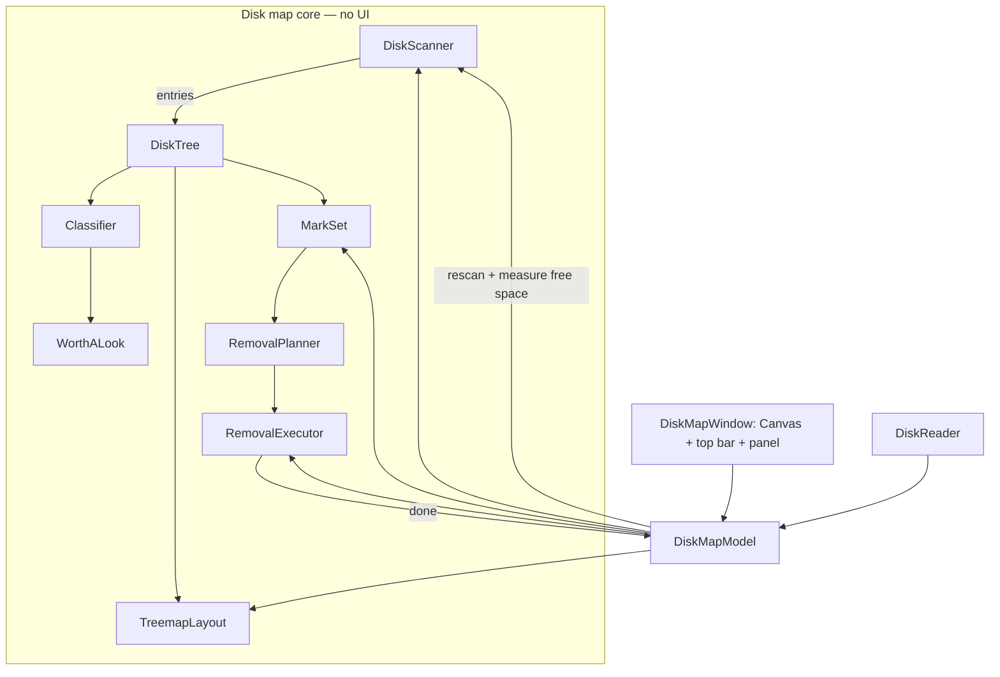
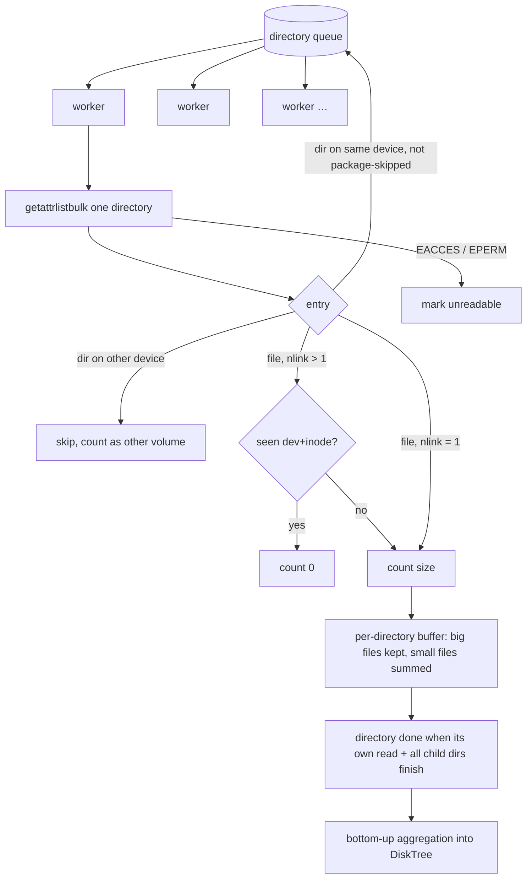
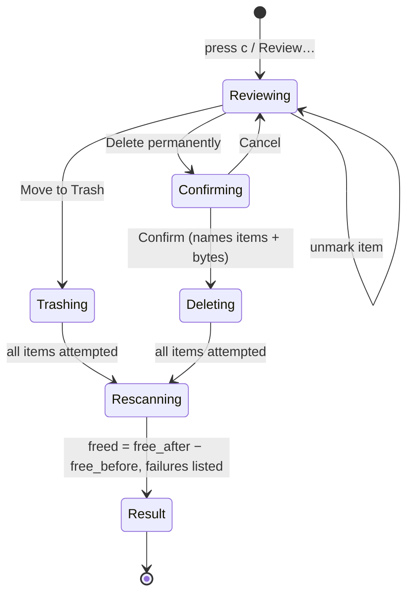

# feat: disktree-style disk map with mark, review, and remove

## Summary

Replace the one-level Analyze window with a native treemap of the home folder, modeled on tobi/disktree. It scans with a parallel Swift scanner, colours tiles by kind of data, hatches space that can be had back, and lets the user mark → review → Move to Trash or delete permanently under tested safety rules. Afterwards it rescans and reports the measured gain.

---

## Problem Frame

The current Analyze window shows one folder at a time through `mole analyze -json`. It can't show the whole shape of the disk at once, and it can't act on what it finds (see origin: `docs/brainstorms/2026-09-24-macd-menu-bar-requirements.md`). disktree proves the better model: a treemap where colour answers "what is it" and a hatch answers "can I delete it". It only runs on Linux, though (GPUI and Vulkan, `/proc/self/mounts`, btrfs, XDG trash). Its engine is MIT-licensed and portable in design but not in code. macOS adds constraints disktree never meets: privacy (TCC) prompts, iCloud files that exist only in the cloud, APFS firmlinks, clones and snapshots, and app bundles that are really directories.

---

## Requirements

From origin (IDs match the origin doc):

**Disk map**
- R13. A treemap of the home folder, tile area = size on disk, with drill-down.
- R14. Reveal any item in Finder.
- R19. Colour by kind of data. A hatch marks space that can be had back.
- R20. Size / Files / Age modes. Hidden-files, apparent-size, and depth controls.
- R21. The panel shows selection details, "Worth a look", and free space now and after the marks.
- R22. Filter by name. Scroll or pinch zoom toward the pointer, entering a folder once it fills the view.

**Marking and removal**
- R23. Mark and unmark. Marking a folder absorbs marks inside it, and nothing is counted twice.
- R24. Review screen. Trash by default. Permanent delete always confirms, naming what goes and the bytes.
- R25. Rescan after removal and report the measured gain.
- R26. Refuse: filesystem root, scanned root, home, `~/Library` itself, system folders, other volumes, and anything inside a bundle or package.

**macOS**
- R27. Unreadable folders are shown as such, with a path to grant Full Disk Access.
- R28. Never materialize cloud-only iCloud files. Count hardlinks once.
- R29. Widen the scan to the whole data volume.

**Origin acceptance examples:** AE6 (absorbed marks count once), AE7 (Trash → rescan → measured gain), AE8 (refuse inside Photos Library), AE9 (unreadable Mail → Full Disk Access).

---

## Key Technical Decisions

- **Port disktree's engine to Swift, not link it.** Its core is Rust tied to Linux (mount tables, btrfs, XDG trash) with a GPUI front end. A Swift port keeps one toolchain and lets the macOS rules sit at the centre. Credit to disktree's MIT copyright ships in the third-party notices.
- **The scanner reads each directory with `getattrlistbulk`, in parallel:** one system call returns every entry's name, type, allocated size, logical size, inode, link count, device, flags, and modification time. That is several times faster than a `stat` per file on APFS. Workers pull directories from a shared queue, sized to the active core count, following dust's shape (one queue, a pending-children counter per directory, bottom-up aggregation).
- **Disk usage = allocated size by default.** That is `du`'s number and roughly what deleting frees. Apparent size is a toggle. Both are stored, so toggling doesn't rescan.
- **The tree is stored as flat arrays, not one object per node:** parent index, child ranges, both sizes, file count, newest modification time, flags, and names in one shared string table. Small files (under 1 MB) collapse into one "N smaller files" entry per folder, which keeps a multi-million-file home folder to a few hundred thousand nodes. That entry can't be marked, because it isn't a real path.
- **Hardlinks count once:** a file with more than one link is counted only the first time its (device, inode) pair is seen.
- **Stay on one volume.** Skip any directory whose device differs from the root's. Scanning `~` never crosses into other disks, network shares, or `/Volumes`. "Whole disk" scans `/System/Volumes/Data`: the system volume is sealed and read-only, and every path users can touch is firmlinked from the data volume.
- **Never materialize iCloud files.** The scan turns off dataless-file materialization for its threads through the I/O policy API. Dataless entries count 0 bytes and are flagged "in iCloud".
- **Unreadable is a first-class state.** Permission errors mark the directory unreadable and count it in the top bar. Nothing is guessed. Protected folders (Mail, Messages, Safari, other apps' containers) show how to grant Full Disk Access. Desktop, Documents, and Downloads trigger the standard macOS prompts, so their usage descriptions go in `Info.plist`.
- **Bundles and packages are single tiles.** A directory that is a package (`.app`, `.photoslibrary`, `.xcarchive`, and so on, detected through the "is package" resource value) is shown as one tile you can drill into. Marking inside one is refused (R26, AE8).
- **Classification ports disktree's name rules and adds macOS ones:** `~/Library/Caches` and `~/Library/Developer/Xcode/DerivedData` (hatched), iOS DeviceSupport (hatched), CoreSimulator (toolchain, not hatched: `simctl` is the right tool), `~/Library/Mobile Documents` (synced / iCloud), `.Trash` (hatched), and Photos and Music libraries (media).
- **Squarified layout ported from disktree's `treemap.rs`** (Bruls, Huizing and van Wijk), with its header bands and a minimum tile size so the number of tiles drawn stays bounded. Layout runs off the main actor and is recomputed only on resize, navigation, a mode change, or a depth change.
- **Draw with SwiftUI `Canvas`:** one pass fills and hatches the rectangles, then draws the labels for tiles large enough to hold them. Hit testing searches the tile list, deepest first.
- **Trash uses `FileManager.trashItem`, and permanent delete uses `removeItem`.** Neither follows symlinks. Before touching a path, each removal re-checks with `lstat` that it is the same inode on the same device as when it was scanned. That guards against the path being swapped between scan and removal.
- **The measured gain comes from volume free space before and after.** The existing `DiskReader` measure also covers clones and snapshots, which can make the marked total overstate what comes back. The UI says so.
- **Mole's analyze is dropped.** `AnalyzeDecoder` and `AnalyzeModel` are deleted. Mole stays for Free Up Space.

---

## High-Level Technical Design

Components and data flow:



Scan pipeline (R13, R27, R28):



Mark rules (R23, AE6), shown as directional pseudo-code:

```text
mark(p):
  if p is inside a package or refused → reject with reason
  if an ancestor of p is marked → reject ("unmark <ancestor> instead")
  remove every mark that is a descendant of p     // absorbed
  add p
marked bytes = sum of sizes of the marks          // disjoint by construction
free after   = free now + marked bytes (shown as "up to")
```

Removal flow (R24, R25):



---

## Output Structure

```text
Macd/DiskMap/
  Core/     DiskTree, DiskScanner, BulkDirectoryReader, Classifier, WorthALook,
            TreemapLayout, MarkSet, RemovalPlanner, RemovalExecutor, VolumeInfo
  DiskMapModel.swift
  UI/       DiskMapWindow, TreemapCanvas, TopBar, Legend, SidePanel,
            ReviewSheet, PrivacyNotice, KeyMap
MacdTests/DiskMap/
  DiskTreeTests, DiskScannerTests, ClassifierTests, WorthALookTests,
  TreemapLayoutTests, MarkSetTests, RemovalPlannerTests, RemovalExecutorTests,
  DiskMapModelTests, TestFileTree (fixture builder)
```

---

## Implementation Units

### U1. Disk tree store and aggregation

**Goal:** A compact tree that holds a multi-million-entry scan and answers size, count, and age for any node.

**Requirements:** R13, R20

**Dependencies:** none

**Files:** `Macd/DiskMap/Core/DiskTree.swift`, `MacdTests/DiskMap/DiskTreeTests.swift`

**Approach:** Flat arrays indexed by node ID: parent, first child and child count (children stored contiguously once a directory finishes), allocated and logical bytes, file count, newest modification time, a kind (directory, file, small-files aggregate, unreadable, other volume), flags (package, dataless, hidden), and name offsets into one shared string table. The builder accepts finished directories in any order and links them to their parent when the parent completes. Aggregation is bottom-up. Children are sorted by the active metric (bytes, apparent bytes, or file count). The tree can rebuild a node's path from the root and look a path back up.

**Test scenarios:**
- A folder with 3 files (10, 20, 30 bytes allocated) aggregates to 60, with file count 3 and newest mtime = the maximum.
- Nested folders aggregate at every level, and the root total equals the sum of the leaves.
- Switching the metric to file count reorders children by count, not bytes.
- Path round-trip: rebuilding a deep node's path and looking it up returns the same node ID.
- An unreadable child contributes 0 bytes and is still listed with its kind.
- An empty folder has size 0 and no children.

**Verification:** A synthetic tree of 1 million nodes builds and aggregates in well under a second in a test.

### U2. Parallel scanner

**Goal:** Fast, cancellable, progress-reporting scans that are correct on macOS.

**Requirements:** R13, R27, R28, R29

**Dependencies:** U1

**Files:** `Macd/DiskMap/Core/BulkDirectoryReader.swift`, `Macd/DiskMap/Core/DiskScanner.swift`, `Macd/DiskMap/Core/VolumeInfo.swift`, `MacdTests/DiskMap/DiskScannerTests.swift`, `MacdTests/DiskMap/TestFileTree.swift`

**Approach:** `BulkDirectoryReader` wraps `getattrlistbulk` for one directory. It opens with `O_DIRECTORY | O_NOFOLLOW` and returns typed entries, surfacing permission errors distinctly. `DiskScanner` runs workers equal to the active core count over a shared queue, and uses a per-directory pending counter so a directory finishes only after all its subdirectories do. Options: include hidden (default on), stay on one volume (default on), dedupe hardlinks (default on), and small-file threshold (1 MB). Each worker thread disables dataless materialization through the I/O policy API. Progress (entries, bytes, unreadable count) lives in atomics that the UI polls. Cancellation is cooperative. Symlinks are never followed and count as their own small size. Package directories are scanned normally but flagged. "Whole disk" roots the scan at `/System/Volumes/Data`.

**Test scenarios (on temporary folder trees):**
- The allocated total matches the sum of `lstat` block counts for a generated tree of about 2,000 files in nested folders.
- A file hardlinked twice in different folders counts once in the root total, with dedupe on, and twice with it off.
- A symlink to a large file adds only the link's own size, and the target isn't counted twice.
- A folder with mode `000` becomes unreadable, the unreadable count is 1, and the scan still completes.
- Files under 1 MB in one folder collapse into a single small-files entry whose bytes and count equal their sums. A 5 MB file stays its own node.
- Hidden entries are excluded when include-hidden is off.
- Cancelling mid-scan returns promptly with a cancelled result, not a partial tree presented as complete.
- A folder containing a `.app`-style package is flagged as a package.

**Verification:** Scanning the author's home folder completes and its total is within a few percent of `du -sk ~` (the difference comes from hardlinks and small-file rounding), with live progress throughout.

### U3. Classification and "Worth a look"

**Goal:** Colour and hatch for every node, and a short list of the biggest plausible removals.

**Requirements:** R19, R21

**Dependencies:** U1

**Files:** `Macd/DiskMap/Core/Classifier.swift`, `Macd/DiskMap/Core/WorthALook.swift`, `MacdTests/DiskMap/ClassifierTests.swift`, `MacdTests/DiskMap/WorthALookTests.swift`

**Approach:** Port disktree's `category_of_name`, `reclaim_of` (including the sibling checks: `target` beside `Cargo.toml`, `node_modules` beside `package.json`), inheritance, and dominant-child rules, plus the macOS rules from the Key Technical Decisions. Classification runs top-down after the scan and stores category and reclaim in the tree. "Worth a look" ports disktree's `insights.rs`: reclaimable folders, agent worktrees, and experiments untouched for 30 days, all at least 64 MB and never nested, largest first. `now` is injected for tests.

**Patterns to follow:** disktree `crates/disktree-core/src/classify.rs` and `insights.rs`.

**Test scenarios:**
- `~/Library/Caches` is Cache and regenerable. Everything under it inherits the hatch.
- `target` beside `Cargo.toml` is build output. `target` without it isn't hatched.
- `node_modules` beside `package.json` is reinstallable.
- An unknown top-level folder that is mostly `.git` becomes Git.
- `~/Library/Developer/Xcode/DerivedData` is hatched. `CoreSimulator` is a toolchain and isn't hatched.
- Worth a look: a 2 GB cache and a 30 MB cache → only the 2 GB one is listed. A reclaimable folder inside another reclaimable folder is listed once, as the outer one.
- Stale experiments: of 3 folders under `tries/`, the 2 untouched for more than 30 days count, and only their bytes are summed.

**Verification:** On the author's Mac, the top of Worth a look matches the obvious big caches (npm, browsers, DerivedData).

### U4. Squarified layout

**Goal:** Nested tiles with header bands, bounded in count, plus hit testing.

**Requirements:** R13, R20, R22

**Dependencies:** U1

**Files:** `Macd/DiskMap/Core/TreemapLayout.swift`, `MacdTests/DiskMap/TreemapLayoutTests.swift`

**Approach:** Port `squarify` and `worst_ratio` directly. Build tiles recursively from the view root down to the chosen depth (default 4, range 1–8). Each directory reserves a header band once it is big enough for a label. Children smaller than a minimum side (about 3 pt) merge into a remainder tile. Each tile carries its node ID, depth, rectangle, and whether it has a label. A filter produces a layout where only matches keep full colour. Hit testing returns the deepest tile containing the point.

**Patterns to follow:** disktree `crates/disktree-core/src/treemap.rs`, including its tests.

**Test scenarios:**
- The canonical values 6, 6, 4, 3, 2, 2, 1 in 600×400 fill the area exactly, with no overlaps, and every aspect ratio is ≤ 3.
- Empty input → no tiles. All-zero values → no tiles and no NaN rectangles.
- Depth 1 produces only the root's children. Depth 3 produces grandchildren inside their parent's rectangle, below the header band.
- Many tiny children produce one remainder tile, and the total tile count stays below a bound.
- A hit test at a point inside a grandchild returns the grandchild, not its parent.

**Verification:** Laying out the author's home tree at depth 4 in a 1400×900 area takes less than a frame budget's worth of work off the main actor.

### U5. Marks and removal

**Goal:** Correct mark semantics, the safety rules, and a removal executor that never touches the wrong thing.

**Requirements:** R23, R24, R26; AE6, AE8

**Dependencies:** U1

**Files:** `Macd/DiskMap/Core/MarkSet.swift`, `Macd/DiskMap/Core/RemovalPlanner.swift`, `Macd/DiskMap/Core/RemovalExecutor.swift`, `MacdTests/DiskMap/MarkSetTests.swift`, `MacdTests/DiskMap/RemovalPlannerTests.swift`, `MacdTests/DiskMap/RemovalExecutorTests.swift`

**Approach:** `MarkSet` implements the rules sketched in the High-Level Technical Design. `RemovalPlanner` ports disktree's `refuse` with macOS trees: `/System`, `/usr`, `/bin`, `/sbin`, `/private/etc`, `/private/var/db`, `/Library/Apple`, plus the scanned root, home, `~/Library` itself, any mount point (different device from its parent), and any path inside a package. Each refusal carries a human reason. `RemovalExecutor` handles each target in order: re-`lstat` and compare device and inode with the scan, then trash or remove. It collects per-item success or failure with the error and never stops the batch on one failure.

**Execution note:** Implement the refusal rules test-first. They are the safety boundary.

**Patterns to follow:** disktree `crates/disktree-core/src/removal.rs` and its tests. `crates/disktree-app/src/marks.rs` for the absorb rules.

**Test scenarios:**
- Covers AE6. Mark `a/b/node_modules`, then mark `a/b` → one mark, and the marked bytes equal the size of `a/b`.
- Marking inside a marked folder → rejected with "unmark a/b instead". Unmarking twice is a no-op.
- The small-files aggregate can't be marked.
- Refusals: `/`, the scanned root, home, `~/Library`, `/System/Library/X`, `/usr/bin`, a path on another device, and a path outside the scanned root are each refused with a reason.
- Covers AE8. `~/Pictures/Photos Library.photoslibrary/originals` → refused as inside a package. The package itself can be marked.
- The executor, on a temporary tree: Trash moves a folder into the Trash and returns its trashed URL. Permanent delete removes the folder and leaves its sibling.
- A symlink pointing at a folder outside the tree → the link is removed and the target remains.
- A path replaced after the scan (different inode) → skipped with "changed since the scan", and nothing is removed.
- One failing item (read-only parent) → reported as failed, and the other items still complete.
- A file named `-rf` is removed as a normal file.

**Verification:** Every refusal rule has a passing test, and the executor tests run only inside temporary folders.

### U6. Disk map model

**Goal:** One observable state object that drives scanning, navigation, modes, selection, marks, review, and rescan.

**Requirements:** R13, R20–R25, R29; F2, F3; AE7

**Dependencies:** U2, U3, U4, U5

**Files:** `Macd/DiskMap/DiskMapModel.swift`, `MacdTests/DiskMap/DiskMapModelTests.swift`

**Approach:** State covers the scan phase (idle / scanning with progress / ready / failed / cancelled), the scan root, the navigation trail (view root), metric (size / files / age), apparent-size and hidden toggles, depth, filter text, selection, marks, the review state machine, and the last removal result. The scanner and executor sit behind protocols so tests can fake them. Metric, apparent-size, and depth changes relayout without rescanning. The hidden toggle rescans. "Whole disk" rescans at the data volume and selects the folder the user came from. After a removal, the model records free space, runs the executor, rescans the same root, measures free space again, and reports the gain and any failures.

**Test scenarios:**
- Scanning, then ready: the view root is the scan root and the selection is its largest child.
- Entering a folder pushes the trail, and going up pops it. Going up at the root is a no-op.
- Switching the metric to files changes tile order without calling the scanner again.
- Covers AE7. Mark 12 GB, then Move to Trash: the executor is called with the planned targets, the scanner is called again, and the result shows the gain measured from injected free-space readings.
- A permanent delete only runs after confirmation. Cancel on the confirm step leaves the marks intact.
- A partial failure keeps failed items marked, clears the rest, and lists the failures.
- A new scan while one is running cancels the first.

**Verification:** The whole flow runs in tests against fake scanner and executor implementations.

### U7. Treemap window, panel, and keyboard

**Goal:** The disktree-style screen.

**Requirements:** R13, R14, R19–R21, R23; F2

**Dependencies:** U6

**Files:** `Macd/DiskMap/UI/DiskMapWindow.swift`, `Macd/DiskMap/UI/TreemapCanvas.swift`, `Macd/DiskMap/UI/TopBar.swift`, `Macd/DiskMap/UI/Legend.swift`, `Macd/DiskMap/UI/SidePanel.swift`, `Macd/DiskMap/UI/KeyMap.swift`, `MacdTests/DiskMap/KeyMapTests.swift`

**Approach:** The top bar shows the breadcrumb trail (each crumb has a menu of its siblings, largest first), the Size / Files / Age segmented control, the Hidden and Apparent toggles, and the depth stepper. Below it sit scan totals, the filter, and the legend. `TreemapCanvas` draws muted category fills that lighten with depth, a diagonal hatch for reclaimable tiles, a coloured strip and name band on top-level tiles, amber for the selection, and a danger colour for marked tiles and everything inside them. In Age mode the fill shows last write instead. The side panel shows the selection (large size, share, files, last write, kind, "in iCloud" or unreadable notes, Reveal in Finder), Worth a look (click to select, with a mark button), the marked list, and disk free now → after the marks with a Review… button. The key map mirrors disktree: space/x mark, return open, delete/esc up, arrows move, tab next largest, `[` `]` depth, `/` filter, `c` review, `t` mode, `d` apparent, `i` hidden, `r` rescan, `g` whole disk, `0` reset, `?` all keys.

**Test scenarios:**
- The key map translates each documented key to its model action, and unknown keys do nothing.
- Label policy: tiles narrower than the minimum label width get no text.

**Verification:** The window renders the author's home folder, with tiles, labels, hatching, and the panel matching disktree's structure, and stays responsive while hovering and selecting.

### U8. Zoom and magnify

**Goal:** disktree's continuous zoom: magnify toward the pointer, then go into the folder once it fills the view.

**Requirements:** R22

**Dependencies:** U7

**Files:** `Macd/DiskMap/UI/TreemapCanvas.swift` (zoom transform), `Macd/DiskMap/UI/ZoomController.swift`, `MacdTests/DiskMap/ZoomControllerTests.swift`

**Approach:** A zoom controller holds scale and offset, driven by scroll-wheel and pinch events anchored at the pointer. When the directory under the pointer fills the viewport past a threshold, the controller commits navigation into it and resets the transform with a short animation. Reverse scroll at scale 1 goes up a level. `-`, `=`, and `0` magnify, shrink, and reset. Shift-scroll pans.

**Test scenarios:**
- Magnifying toward a point keeps that point fixed on screen.
- Crossing the fill threshold emits "enter folder X" exactly once.
- Reverse scroll at scale 1 emits "go up".
- Scale is clamped between 1 and the maximum.

**Verification:** Trackpad zoom into `~/Library` feels continuous and lands inside the folder.

### U9. Review sheet, privacy onboarding, and integration

**Goal:** A safe removal UI, honest permission handling, and a replacement for the old Analyze window.

**Requirements:** R24, R25, R27; AE7, AE9

**Dependencies:** U6, U7

**Files:** `Macd/DiskMap/UI/ReviewSheet.swift`, `Macd/DiskMap/UI/PrivacyNotice.swift`, `Macd/App/MacdApp.swift`, `Macd/UI/PanelView.swift`, `project.yml` (usage descriptions), `Macd/Resources/THIRD_PARTY_NOTICES.md`, `README.md`; delete `Macd/Mole/AnalyzeDecoder.swift`, `Macd/Mole/AnalyzeModel.swift`, `Macd/UI/AnalyzeWindow.swift`, `MacdTests/AnalyzeDecoderTests.swift`, `MacdTests/Fixtures/mole-analyze-1.49.2.json`

**Approach:** The review sheet lists the marked items with sizes and lets the user unmark rows. Move to Trash is the default button. Delete Permanently opens a confirmation naming the item count, the largest few items, and the total bytes. The result view shows the measured gain, any failures, and a note that clones and snapshots can reduce what comes back. The privacy notice appears before the first scan and explains the Desktop, Documents, and Downloads prompts and Full Disk Access. The unreadable count in the top bar and in the panel for unreadable tiles links to the Full Disk Access pane in System Settings. The menu bar panel's Analyze Disk… opens the new window. Usage descriptions for Desktop, Documents, and Downloads are added. The disktree MIT notice is added to the third-party notices.

**Test scenarios:**
- Covers AE9. An unreadable node selected in the model reports "grant Full Disk Access" as its panel action.
- The confirmation summary for 3 items (5 GB, 2 GB, 100 MB) names all three and totals 7.1 GB.
- The old analyze tests and fixture are removed, and the suite still passes.

**Verification:** A marked folder in a scratch location goes to the Trash from the app, the map rescans, and the gain shown matches Finder's change in free space.

---

## Scope Boundaries

**Deferred for later** (from origin, unchanged)
- Individual categories in the cleanup preview. Uninstall, purge, installer cleanup, and admin-level cleaning. Scheduled cleaning. Temperature and memory-pressure alerts. History charts.

**Outside this product's identity** (from origin)
- A full metrics dashboard. Mac App Store distribution.

### Deferred to Follow-Up Work
- Git status in the selection panel (changes, stashes, unpushed commits), which disktree shows for checkouts.
- Reusing a narrower scan when widening to the whole disk (disktree memoizes it). v1 rescans.
- Resizable side panel and interface zoom.
- Feeding Mole's clean categories into Worth a look.

---

## Risks & Dependencies

| Risk | Mitigation |
|---|---|
| Scan speed or memory on multi-million-file homes | `getattrlistbulk`, parallel workers, small-file collapse, flat arrays. U1 and U2 carry performance checks. |
| Deleting the wrong thing | Refusal rules written test-first. Inode re-check before each removal. Trash by default. Confirmation for permanent delete. Tests run only in temporary folders. |
| Privacy prompts surprise users mid-scan | Notice before the first scan. Usage strings. Unreadable shown explicitly. |
| iCloud downloads triggered by scanning | Dataless materialization is disabled per scan thread. Dataless entries are flagged. |
| Marked total overstates what comes back (clones, snapshots) | Show "up to" before removal and the measured gain after. |
| Canvas performance with many tiles | Minimum tile size and remainder tiles bound the count. Layout runs off the main actor and is cached per state. |
| Private-but-stable APIs (`getattrlistbulk`, I/O policy) | Both are public C APIs in the macOS SDK. The scanner falls back to reporting per-directory errors, never crashing. |

---

## Open Questions

**Deferred to implementation**
- Exact thresholds for the minimum tile side, the label width, and the zoom-enter threshold. Tune on the author's home folder.
- Whether children sort cheaply enough per metric switch at this scale, or need cached per-metric orderings.
- The exact Full Disk Access settings URL on macOS 26. Verify it at implementation time.

---

## Sources & Research

- disktree (https://github.com/tobi/disktree, MIT, commit bf6cbbf): `crates/disktree-core/src/scan.rs` (dust-style scan), `treemap.rs` (squarified layout and tests), `classify.rs` (kinds and reclaim rules), `insights.rs` (Worth a look), `removal.rs` (refusal rules and tests), and `crates/disktree-app/src/marks.rs` (mark absorption). README sections "What it measures", "What it refuses to do", and Keys.
- Existing mac'd code: `Macd/Metrics/DiskReader.swift` (free space, reused for the measured gain), `Macd/App/MacdApp.swift` (window scenes), and `Macd/UI/PanelView.swift` (Analyze Disk… entry point).
- Current Analyze implementation replaced by this plan: `Macd/Mole/AnalyzeModel.swift`, `Macd/UI/AnalyzeWindow.swift`.
